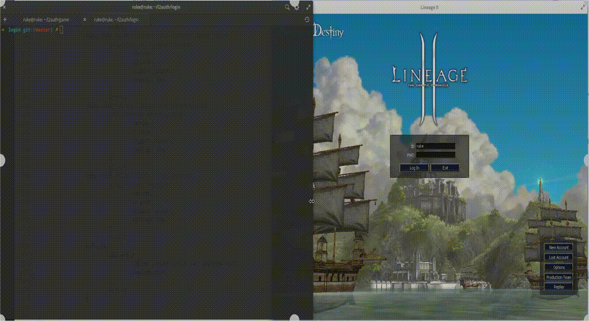

## L2 Auth
Simple Lineage 2 C4 server written as a learning exercise.
Currently working in WINDOWS & LINUX (thanks to Docker).

## Running the server with Docker
- Install docker & docker-compose
- `docker-compose up`
- Server will start listening to address 127.0.0.1 (local) and port 2106.

## Setting up DEV environment
- Follow instructions to build log dependency from Dockerfile
- `sudo apt install libssl-dev`

## What to expect
Right now, the server will listen for up to two connections.
For the time being, the server is capable of:
- Create socket/connection
- Listen for connections
- Accept connections
- Encrypt connection with RSA & Blowfish
- Send Lineage 2 packets
- Receive Lineage 2 packets
- Log in
- Enter world
- Restart
- Very early multiple connection support

## Lineage 2 Protocol
Lineage 2 uses TCP in order to send packets.

All integers are little endian.

The first two bytes of the packet contain the packet size and the third one, usually the packet type.

Other than the first packet, all packets are encrypted with blowfish using the following hardcoded key: `;5.]94-31==-%xT!^[$\000`.

## Folder structure
- `core`: Core modules, used by both login server and game server
- `game`: Game server code
- `game/dto`: Data transfer objects
- `game/handler`: Handlers for each client request (ie, entering world)
- `game/handler/client`: Entry point for all game server requests
- `game/packet`: Packets sent by game server
- `login`: Login server code
- `login/dto`: Data transfer objects
- `login/handler`: Handlers for each client request
- `login/packet`: Packets sent by login server
- `packet`: To be deprecated
- `socket_strategy`: Contains logic for using linux and windows sockets

## To do
- [ ] Correctly handle big/little endian
- [x] Display terms of service view
- [x] Display server list
- [x] Allow to enter game server
- [x] Create character
- [x] Enter world
- [x] Walk
- [ ] Lua integration? since we got hot reload I don't know if it makes sense
- [x] Handle multiple connections
- [ ] See other players

## Screenshots
Please see doc/screenshot.

## Credits
- l2jserver (http://l2jserver.com/)
- http://fursoffers.narod.ru/Packets.htm
- https://code.google.com/archive/p/l2adenalib/wikis/L2LoginServerProtocol.wiki

## Licence
MIT
